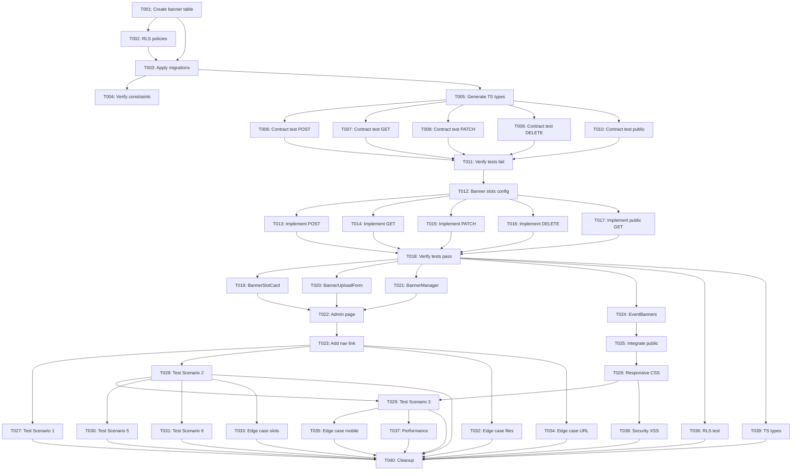

# Tasks: Event Advertisement Banner System

**Feature**: 010-ok-now-i | **Branch**: `010-ok-now-i` | **Date**: 2025-10-13
**Input**: Design documents from `/specs/010-ok-now-i/`
**Prerequisites**: plan.md, research.md, data-model.md, contracts/banner-api.md, quickstart.md

## Execution Flow
```
1. Load plan.md from feature directory ✅
   → Tech stack: TypeScript 5.3+, Next.js 14, Supabase, Tailwind CSS
   → Structure: Web app (frontend + backend API routes)
2. Load design documents ✅
   → data-model.md: `banners` table entity
   → contracts/banner-api.md: 5 API endpoints
   → quickstart.md: 7 validation scenarios
3. Generate tasks by category: Database → Tests → API → UI → Integration → Polish
4. Apply TDD ordering: Tests before implementation
5. Mark [P] for parallel execution (different files)
6. Number sequentially (T001-T040)
7. Validate completeness ✅
```

## Task Format: `[ID] [P?] Description`
- **[P]**: Can run in parallel (different files, no dependencies)
- File paths are absolute from repository root

---

## Phase 3.1: Database Layer (5 tasks)

### T001: Create banner table migration
**Type**: Database
**Estimated Time**: 20 minutes
**Dependencies**: None
**Parallel**: No

**Description**: Create SQL migration file `20250113_create_banners_table.sql` in `supabase/migrations/` with complete schema definition including all fields, constraints, indexes, and comments.

**Acceptance Criteria**:
- [ ] Table `public.banners` created with 12 fields (id, tenant_id, event_id, slot_number, storage_path, filename, file_size, mime_type, click_url, is_active, created_at, updated_at, deleted_at)
- [ ] Primary key on `id` with `gen_random_uuid()` default
- [ ] Foreign keys to `tenants(id)` and `events(id)` with `ON DELETE CASCADE`
- [ ] Check constraints: `slot_number BETWEEN 1 AND 5`, `file_size` 1-5242880 bytes, `mime_type` in (image/jpeg, image/png, image/webp), `click_url` pattern, `storage_path` pattern
- [ ] Partial unique index: `UNIQUE (event_id, slot_number) WHERE deleted_at IS NULL`
- [ ] 3 indexes: `idx_banners_event_id`, `idx_banners_tenant_id`, `idx_banners_slot`
- [ ] Table and column comments added

**Files**:
- `supabase/migrations/20250113_create_banners_table.sql`

**Reference**: `specs/010-ok-now-i/data-model.md` lines 14-56

---

### T002: Create RLS policies migration
**Type**: Database
**Estimated Time**: 15 minutes
**Dependencies**: T001
**Parallel**: No

**Description**: Create SQL migration file `20250113_rls_banners.sql` in `supabase/migrations/` with Row Level Security policies for tenant isolation and public read access.

**Acceptance Criteria**:
- [ ] RLS enabled on `banners` table: `ALTER TABLE banners ENABLE ROW LEVEL SECURITY;`
- [ ] Public read policy: `banners_public_read` allows SELECT for active banners of public events
- [ ] Admin write policy: `banners_admin_write` allows ALL operations for tenant admins
- [ ] Policies avoid infinite recursion (use direct `admins` and `events` table joins)
- [ ] No self-referencing queries in policies

**Files**:
- `supabase/migrations/20250113_rls_banners.sql`

**Reference**: `specs/010-ok-now-i/research.md` lines 142-163

---

### T003: Apply database migrations
**Type**: Database
**Estimated Time**: 10 minutes
**Dependencies**: T001, T002
**Parallel**: No

**Description**: Apply both migrations to local Supabase instance using Supabase CLI or SQL Editor. Verify migrations are recorded in `supabase_migrations` table.

**Acceptance Criteria**:
- [ ] Run migration T001: `npx supabase db push` or execute in Supabase SQL Editor
- [ ] Run migration T002: Apply RLS policies
- [ ] Verify in Supabase Dashboard: Table `banners` exists with correct schema
- [ ] Verify RLS policies active: Query `pg_policies` shows 2 policies on `banners`
- [ ] No migration errors in console

**Commands**:
```bash
cd supabase
npx supabase db push
# OR copy SQL content and paste in Supabase Dashboard SQL Editor
```

**Reference**: `specs/010-ok-now-i/data-model.md` lines 199-208

---

### T004: Verify database constraints
**Type**: Database
**Estimated Time**: 10 minutes
**Dependencies**: T003
**Parallel**: No

**Description**: Manually test database constraints by executing invalid SQL INSERT/UPDATE statements and verifying they are rejected with appropriate error messages.

**Acceptance Criteria**:
- [ ] Invalid slot number rejected: `INSERT ... slot_number = 6` → `violates check constraint`
- [ ] Oversized file rejected: `INSERT ... file_size = 6000000` → `violates check constraint`
- [ ] Invalid mime type rejected: `INSERT ... mime_type = 'image/gif'` → `violates check constraint`
- [ ] Invalid URL protocol rejected: `INSERT ... click_url = 'ftp://example.com'` → `violates check constraint`
- [ ] Duplicate slot rejected: Two banners with same `event_id` and `slot_number` → `violates unique constraint`
- [ ] Invalid storage path rejected: `INSERT ... storage_path = 'invalid/path'` → `violates check constraint`

**Test SQL**:
```sql
-- Test in Supabase SQL Editor
INSERT INTO banners (tenant_id, event_id, slot_number, storage_path, filename, file_size, mime_type)
VALUES ('[test-tenant-id]', '[test-event-id]', 6, 'test.jpg', 'test.jpg', 1024, 'image/jpeg');
-- Expected: ERROR violates check constraint "banners_slot_number_check"
```

**Reference**: `specs/010-ok-now-i/data-model.md` lines 76-94

---

### T005: Generate TypeScript types from schema
**Type**: Database
**Estimated Time**: 5 minutes
**Dependencies**: T003
**Parallel**: No

**Description**: Use Supabase CLI to generate TypeScript types from database schema and save to `frontend/src/types/database.types.ts`. Verify `Banner` type matches data model specification.

**Acceptance Criteria**:
- [ ] Run: `npx supabase gen types typescript --local > frontend/src/types/database.types.ts`
- [ ] File created with `Database` type export
- [ ] `Database['public']['Tables']['banners']` type exists
- [ ] Banner type includes all 12 fields with correct TypeScript types
- [ ] `slot_number` typed as `number` (database integer)
- [ ] `click_url` typed as `string | null`
- [ ] `deleted_at` typed as `string | null`

**Files**:
- `frontend/src/types/database.types.ts` (generated)

**Reference**: `specs/010-ok-now-i/data-model.md` lines 145-195

---

## Phase 3.2: Contract Tests (TDD) ⚠️ MUST COMPLETE BEFORE 3.3

**CRITICAL: These tests MUST be written and MUST FAIL before ANY API implementation**

### T006: [P] Contract test - POST /api/events/[id]/banners
**Type**: Contract Test
**Estimated Time**: 25 minutes
**Dependencies**: T005
**Parallel**: Yes (different file from T007-T010)

**Description**: Write contract test for banner upload endpoint in `frontend/tests/contract/banners.test.ts`. Test valid upload, file validation errors, slot conflicts, and authentication requirements.

**Acceptance Criteria**:
- [ ] Test file created: `frontend/tests/contract/banners.test.ts`
- [ ] Test suite: `describe('POST /api/events/[eventId]/banners')`
- [ ] Test case: Upload valid banner → 201 Created with banner object
- [ ] Test case: Upload without authentication → 401 Unauthorized
- [ ] Test case: Upload invalid file type (PDF) → 400 Bad Request with `INVALID_FILE_TYPE`
- [ ] Test case: Upload oversized file (6MB) → 413 Payload Too Large
- [ ] Test case: Upload to occupied slot → 400 Bad Request with `SLOT_OCCUPIED`
- [ ] Test case: Invalid slot number (0 or 6) → 400 Bad Request
- [ ] Test case: Upload with invalid click URL → 400 Bad Request
- [ ] **Test MUST FAIL** when run (endpoint not implemented yet)
- [ ] Uses Vitest for test framework
- [ ] Uses `FormData` for multipart upload simulation

**Files**:
- `frontend/tests/contract/banners.test.ts` (new)

**Reference**: `specs/010-ok-now-i/contracts/banner-api.md` lines 12-78

---

### T007: [P] Contract test - GET /api/events/[id]/banners
**Type**: Contract Test
**Estimated Time**: 15 minutes
**Dependencies**: T005
**Parallel**: Yes (same file as T006, but different test suite)

**Description**: Add contract test for banner listing endpoint in same test file. Test successful retrieval, filtering, and authentication.

**Acceptance Criteria**:
- [ ] Test suite added: `describe('GET /api/events/[eventId]/banners')`
- [ ] Test case: Get banners → 200 OK with array of banners, total count, available slots
- [ ] Test case: Get banners with `active_only=true` query param → only active banners returned
- [ ] Test case: Get banners without authentication → 401 Unauthorized
- [ ] Test case: Get banners for non-existent event → 404 Not Found
- [ ] Response schema validation: `{ banners: Banner[], total: number, available_slots: number[] }`
- [ ] **Test MUST FAIL** when run

**Files**:
- `frontend/tests/contract/banners.test.ts` (append to existing)

**Reference**: `specs/010-ok-now-i/contracts/banner-api.md` lines 81-139

---

### T008: [P] Contract test - PATCH /api/banners/[id]
**Type**: Contract Test
**Estimated Time**: 20 minutes
**Dependencies**: T005
**Parallel**: Yes (same file, different suite)

**Description**: Add contract test for banner update endpoint. Test slot changes, click URL updates, activation toggle, and slot conflict handling.

**Acceptance Criteria**:
- [ ] Test suite added: `describe('PATCH /api/banners/[bannerId]')`
- [ ] Test case: Update slot number → 200 OK with updated banner
- [ ] Test case: Update click URL → 200 OK
- [ ] Test case: Update is_active → 200 OK
- [ ] Test case: Update without authentication → 401 Unauthorized
- [ ] Test case: Update non-existent banner → 404 Not Found
- [ ] Test case: Move to occupied slot → 409 Conflict with `SLOT_CONFLICT`
- [ ] Test case: Update with empty body → 400 Bad Request
- [ ] Test case: Update with invalid slot number → 400 Bad Request
- [ ] **Test MUST FAIL** when run

**Files**:
- `frontend/tests/contract/banners.test.ts` (append)

**Reference**: `specs/010-ok-now-i/contracts/banner-api.md` lines 142-194

---

### T009: [P] Contract test - DELETE /api/banners/[id]
**Type**: Contract Test
**Estimated Time**: 15 minutes
**Dependencies**: T005
**Parallel**: Yes (same file, different suite)

**Description**: Add contract test for banner soft-delete endpoint. Test successful deletion, authentication, and idempotency.

**Acceptance Criteria**:
- [ ] Test suite added: `describe('DELETE /api/banners/[bannerId]')`
- [ ] Test case: Delete banner → 204 No Content
- [ ] Test case: Delete without authentication → 401 Unauthorized
- [ ] Test case: Delete non-existent banner → 404 Not Found
- [ ] Test case: Delete already deleted banner → 404 Not Found
- [ ] Verify database: `deleted_at` populated after delete (not physically removed)
- [ ] **Test MUST FAIL** when run

**Files**:
- `frontend/tests/contract/banners.test.ts` (append)

**Reference**: `specs/010-ok-now-i/contracts/banner-api.md` lines 197-222

---

### T010: [P] Contract test - GET /api/public/events/[slug]/banners
**Type**: Contract Test
**Estimated Time**: 15 minutes
**Dependencies**: T005
**Parallel**: Yes (same file, different suite)

**Description**: Add contract test for public banner display endpoint. Test anonymous access, active-only filtering, and response schema.

**Acceptance Criteria**:
- [ ] Test suite added: `describe('GET /api/public/events/[slug]/banners')`
- [ ] Test case: Get public banners → 200 OK with banner array (NO authentication required)
- [ ] Test case: Only active banners returned (`is_active = true`)
- [ ] Test case: Only non-deleted banners returned (`deleted_at IS NULL`)
- [ ] Test case: Banners sorted by slot_number ascending
- [ ] Test case: Response includes dimensions from slot configuration
- [ ] Response schema: `{ banners: Array<{ slot_number, storage_url, click_url, dimensions }> }`
- [ ] **Test MUST FAIL** when run

**Files**:
- `frontend/tests/contract/banners.test.ts` (append)

**Reference**: `specs/010-ok-now-i/contracts/banner-api.md` lines 225-270

---

### T011: Verify all contract tests fail
**Type**: Contract Test
**Estimated Time**: 5 minutes
**Dependencies**: T006, T007, T008, T009, T010
**Parallel**: No

**Description**: Run the complete contract test suite and verify ALL tests fail with "endpoint not found" or similar errors (because API routes don't exist yet). This confirms TDD workflow.

**Acceptance Criteria**:
- [ ] Run: `cd frontend && npm test tests/contract/banners.test.ts`
- [ ] All tests fail with 404 Not Found or network errors
- [ ] No tests pass (would indicate premature implementation)
- [ ] Test output clearly shows failure reasons
- [ ] Screenshot or log test failures for documentation

**Commands**:
```bash
cd frontend
npm test tests/contract/banners.test.ts -- --reporter=verbose
```

**Reference**: TDD principle from Constitution III

---

## Phase 3.3: API Implementation (ONLY after tests are failing)

### T012: Create banner slot configuration
**Type**: Core
**Estimated Time**: 10 minutes
**Dependencies**: T011
**Parallel**: No

**Description**: Create TypeScript enum and configuration object for banner slots in `frontend/src/lib/banner-slots.ts`. Define 5 slots with unique dimensions and labels.

**Acceptance Criteria**:
- [ ] File created: `frontend/src/lib/banner-slots.ts`
- [ ] Export `BannerSlot` enum with values 1-5 (HEADER_MAIN, SIDEBAR_TOP, CONTENT_MID, SIDEBAR_BOTTOM, FOOTER)
- [ ] Export `SLOT_DIMENSIONS` record mapping slot numbers to `{ width, height, label }`
- [ ] Slot 1: 1200x300px "Header Banner"
- [ ] Slot 2: 300x600px "Sidebar Top"
- [ ] Slot 3: 970x250px "Content Banner"
- [ ] Slot 4: 300x250px "Sidebar Bottom"
- [ ] Slot 5: 728x90px "Footer Banner"
- [ ] All exports use TypeScript types

**Files**:
- `frontend/src/lib/banner-slots.ts` (new)

**Reference**: `specs/010-ok-now-i/research.md` lines 62-79

---

### T013: Implement POST /api/events/[id]/banners (upload)
**Type**: API
**Estimated Time**: 45 minutes
**Dependencies**: T011, T012
**Parallel**: No

**Description**: Implement banner upload API route at `frontend/src/app/api/events/[id]/banners/route.ts`. Handle multipart file upload, validate file, upload to Supabase Storage, create database record.

**Acceptance Criteria**:
- [ ] File created: `frontend/src/app/api/events/[id]/banners/route.ts`
- [ ] Export `async function POST(request: NextRequest, { params }: { params: { id: string } })`
- [ ] Parse multipart form data: file, slot_number, click_url, is_active
- [ ] Validate authentication: Check Supabase session
- [ ] Validate tenant admin: User in `admins` table for event's tenant
- [ ] Validate file: MIME type (JPEG/PNG/WebP), size (max 5MB)
- [ ] Check slot availability: Query `banners` for existing active banner in slot
- [ ] Generate storage path: `tenant-{tenant_id}/event-{event_id}/banner-{id}-slot-{slot}.{ext}`
- [ ] Upload to Supabase Storage: `supabase.storage.from('banners').upload()`
- [ ] Insert database record: All fields populated
- [ ] Return 201 Created with banner object including storage URL
- [ ] Error handling: 400 (invalid file/slot), 401 (no auth), 403 (not admin), 413 (too large)
- [ ] Contract tests T006 MUST PASS after this task

**Files**:
- `frontend/src/app/api/events/[id]/banners/route.ts` (new)

**Reference**: `specs/010-ok-now-i/contracts/banner-api.md` lines 12-78

---

### T014: Implement GET /api/events/[id]/banners (list)
**Type**: API
**Estimated Time**: 25 minutes
**Dependencies**: T011, T012
**Parallel**: No (same file as T013)

**Description**: Add GET handler to same route file for listing banners. Support `active_only` query parameter.

**Acceptance Criteria**:
- [ ] Add export: `async function GET(request: NextRequest, { params }: { params: { id: string } })`
- [ ] Validate authentication and tenant admin access
- [ ] Parse query param: `active_only` (boolean, default false)
- [ ] Query banners: `SELECT * FROM banners WHERE event_id = $1 AND deleted_at IS NULL`
- [ ] If `active_only=true`: Add `AND is_active = true` to query
- [ ] Order by: `slot_number ASC`
- [ ] Calculate available slots: Find slots 1-5 not in result set
- [ ] Return 200 OK: `{ banners: Banner[], total: number, available_slots: number[] }`
- [ ] Error handling: 401 (no auth), 403 (not admin), 404 (event not found)
- [ ] Contract tests T007 MUST PASS after this task

**Files**:
- `frontend/src/app/api/events/[id]/banners/route.ts` (append)

**Reference**: `specs/010-ok-now-i/contracts/banner-api.md` lines 81-139

---

### T015: Implement PATCH /api/banners/[bannerId] (update)
**Type**: API
**Estimated Time**: 35 minutes
**Dependencies**: T011
**Parallel**: No

**Description**: Implement banner update API route at `frontend/src/app/api/banners/[bannerId]/route.ts`. Support partial updates to slot_number, click_url, and is_active.

**Acceptance Criteria**:
- [ ] File created: `frontend/src/app/api/banners/[bannerId]/route.ts`
- [ ] Export `async function PATCH(request: NextRequest, { params }: { params: { bannerId: string } })`
- [ ] Parse JSON body: `{ slot_number?, click_url?, is_active? }`
- [ ] Validate at least one field provided
- [ ] Validate authentication and tenant admin access
- [ ] Fetch existing banner: Verify exists and belongs to admin's tenant
- [ ] If updating slot_number: Check new slot not occupied (unless same banner)
- [ ] Update database: `UPDATE banners SET ... WHERE id = $1 AND deleted_at IS NULL`
- [ ] Update `updated_at` timestamp automatically
- [ ] Return 200 OK with updated banner object
- [ ] Error handling: 400 (invalid data/empty body), 401, 403, 404 (not found/deleted), 409 (slot conflict)
- [ ] Contract tests T008 MUST PASS after this task

**Files**:
- `frontend/src/app/api/banners/[bannerId]/route.ts` (new)

**Reference**: `specs/010-ok-now-i/contracts/banner-api.md` lines 142-194

---

### T016: Implement DELETE /api/banners/[bannerId] (soft delete)
**Type**: API
**Estimated Time**: 20 minutes
**Dependencies**: T011
**Parallel**: No (same file as T015)

**Description**: Add DELETE handler to same route file for soft-deleting banners.

**Acceptance Criteria**:
- [ ] Add export: `async function DELETE(request: NextRequest, { params }: { params: { bannerId: string } })`
- [ ] Validate authentication and tenant admin access
- [ ] Fetch existing banner: Verify exists, not already deleted, belongs to admin's tenant
- [ ] Soft delete: `UPDATE banners SET deleted_at = NOW() WHERE id = $1 AND deleted_at IS NULL`
- [ ] Return 204 No Content (empty response)
- [ ] Error handling: 401 (no auth), 403 (not admin), 404 (not found or already deleted)
- [ ] Contract tests T009 MUST PASS after this task

**Files**:
- `frontend/src/app/api/banners/[bannerId]/route.ts` (append)

**Reference**: `specs/010-ok-now-i/contracts/banner-api.md` lines 197-222

---

### T017: Implement GET /api/public/events/[slug]/banners (public)
**Type**: API
**Estimated Time**: 20 minutes
**Dependencies**: T011, T012
**Parallel**: Yes (different file from T013-T016)

**Description**: Implement public banner display API route at `frontend/src/app/api/public/events/[slug]/banners/route.ts`. NO authentication required.

**Acceptance Criteria**:
- [ ] File created: `frontend/src/app/api/public/events/[slug]/banners/route.ts`
- [ ] Export `async function GET(request: NextRequest, { params }: { params: { slug: string } })`
- [ ] NO authentication check (public endpoint)
- [ ] Query event by slug to get event_id
- [ ] Query banners: `WHERE event_id = $1 AND is_active = true AND deleted_at IS NULL`
- [ ] RLS policy automatically filters to public events only
- [ ] Order by slot_number ASC
- [ ] Map banners to response format: `{ slot_number, storage_url, click_url, dimensions }`
- [ ] Include dimensions from `SLOT_DIMENSIONS` configuration
- [ ] Return 200 OK: `{ banners: [...] }`
- [ ] Error handling: 404 (event not found)
- [ ] Contract tests T010 MUST PASS after this task

**Files**:
- `frontend/src/app/api/public/events/[slug]/banners/route.ts` (new)

**Reference**: `specs/010-ok-now-i/contracts/banner-api.md` lines 225-270

---

### T018: Verify all contract tests pass
**Type**: Integration
**Estimated Time**: 10 minutes
**Dependencies**: T013, T014, T015, T016, T017
**Parallel**: No

**Description**: Run complete contract test suite again and verify ALL tests now PASS. This confirms API implementation matches contracts.

**Acceptance Criteria**:
- [ ] Run: `cd frontend && npm test tests/contract/banners.test.ts`
- [ ] All 20+ test cases pass (POST, GET, PATCH, DELETE, public GET)
- [ ] No test failures
- [ ] Test output shows green checkmarks
- [ ] Screenshot or log successful test run

**Commands**:
```bash
cd frontend
npm test tests/contract/banners.test.ts -- --reporter=verbose
```

**Validation**: TDD cycle complete (red → green)

---

## Phase 3.4: Admin UI Components

### T019: [P] Create BannerSlotCard component
**Type**: UI
**Estimated Time**: 30 minutes
**Dependencies**: T018
**Parallel**: Yes (different file from T020-T023)

**Description**: Create reusable component for displaying a single banner slot in the admin interface. Show slot info, current banner (if any), and action buttons.

**Acceptance Criteria**:
- [ ] File created: `frontend/src/components/admin/BannerSlotCard.tsx`
- [ ] Props interface: `{ slot: BannerSlot, banner: Banner | null, eventId: string, onUpload: (), onEdit: (), onDelete: () }`
- [ ] Display slot number, label, and recommended dimensions
- [ ] If no banner: Show empty state with "Upload Banner" button
- [ ] If banner exists: Show thumbnail preview, filename, file size, click URL, active status
- [ ] Action buttons: Edit (opens modal), Deactivate/Activate toggle, Delete (with confirmation)
- [ ] Use Tailwind CSS for styling
- [ ] Use Lucide React icons for visual elements
- [ ] Responsive design: Stack on mobile, grid on desktop
- [ ] TypeScript with proper prop types

**Files**:
- `frontend/src/components/admin/BannerSlotCard.tsx` (new)

**Reference**: `specs/010-ok-now-i/plan.md` lines 99

---

### T020: [P] Create BannerUploadForm component
**Type**: UI
**Estimated Time**: 40 minutes
**Dependencies**: T018
**Parallel**: Yes (different file)

**Description**: Create form component for uploading new banners. Reuse existing FileDropzone component for file selection. Handle form submission and validation.

**Acceptance Criteria**:
- [ ] File created: `frontend/src/components/admin/BannerUploadForm.tsx`
- [ ] Props: `{ eventId: string, targetSlot: number, onSuccess: (), onCancel: () }`
- [ ] Use existing `FileDropzone` component for file upload
- [ ] File validation: JPEG/PNG/WebP only, max 5MB, show recommended dimensions
- [ ] Form fields: Click URL (optional text input), Active status (checkbox, default true)
- [ ] Submit button disabled during upload
- [ ] Display upload progress (if applicable)
- [ ] Client-side validation before API call
- [ ] Call `POST /api/events/[eventId]/banners` on submit
- [ ] Error handling with toast notifications
- [ ] Success callback triggers parent refresh
- [ ] Form reset after successful upload
- [ ] Use React Hook Form for form management

**Files**:
- `frontend/src/components/admin/BannerUploadForm.tsx` (new)

**Reference**: `specs/010-ok-now-i/research.md` lines 99-123

---

### T021: [P] Create BannerManager component
**Type**: UI
**Estimated Time**: 35 minutes
**Dependencies**: T018
**Parallel**: Yes (different file, but uses T019 and T020)

**Description**: Create main container component for managing all 5 banner slots. Fetch banners on mount, handle CRUD operations, manage modal state.

**Acceptance Criteria**:
- [ ] File created: `frontend/src/components/admin/BannerManager.tsx`
- [ ] Props: `{ eventId: string }`
- [ ] Fetch banners on mount: `GET /api/events/[eventId]/banners`
- [ ] Display loading state while fetching
- [ ] Render 5 `BannerSlotCard` components (one per slot)
- [ ] Pass correct banner data to each slot card (or null if empty)
- [ ] Handle upload button click: Open modal with `BannerUploadForm`
- [ ] Handle edit button click: Open modal with edit form
- [ ] Handle delete button click: Show confirmation dialog, call DELETE endpoint
- [ ] Handle activate/deactivate: Call PATCH endpoint with `is_active` toggle
- [ ] Refresh banner list after any CRUD operation
- [ ] Error handling with user-friendly messages
- [ ] Use modal/dialog component for upload/edit forms
- [ ] Grid layout for slot cards (responsive)

**Files**:
- `frontend/src/components/admin/BannerManager.tsx` (new)

**Reference**: `specs/010-ok-now-i/plan.md` lines 98

---

### T022: Create admin banner management page
**Type**: UI
**Estimated Time**: 25 minutes
**Dependencies**: T019, T020, T021
**Parallel**: No

**Description**: Create Next.js page at `/admin/events/[id]/banners` that renders the BannerManager component. Add page metadata and breadcrumb navigation.

**Acceptance Criteria**:
- [ ] File created: `frontend/src/app/admin/events/[id]/banners/page.tsx`
- [ ] Export default async Server Component
- [ ] Extract `id` param from URL
- [ ] Fetch event data to display event title in header
- [ ] Verify user is authenticated (redirect if not)
- [ ] Render `BannerManager` component with eventId prop
- [ ] Page title: "Manage Banners - {Event Title}"
- [ ] Breadcrumb: Admin Dashboard > Events > {Event Title} > Banners
- [ ] Back button to return to event detail page
- [ ] Export metadata for SEO

**Files**:
- `frontend/src/app/admin/events/[id]/banners/page.tsx` (new)

**Reference**: `specs/010-ok-now-i/plan.md` lines 87-88

---

### T023: Add banner management navigation link
**Type**: UI
**Estimated Time**: 10 minutes
**Dependencies**: T022
**Parallel**: No

**Description**: Add "Manage Banners" button/link to the event detail page in admin dashboard so organizers can easily access banner management.

**Acceptance Criteria**:
- [ ] Locate event detail page: `frontend/src/app/admin/events/[id]/page.tsx` (or equivalent)
- [ ] Add "Manage Banners" button in action menu or card footer
- [ ] Link to: `/admin/events/[id]/banners`
- [ ] Use appropriate icon (e.g., `<ImageIcon />` from Lucide React)
- [ ] Button styled consistently with existing admin UI
- [ ] Button visible to all tenant admins

**Files**:
- `frontend/src/app/admin/events/[id]/page.tsx` (modify existing)

**Manual Test**: Navigate to admin dashboard → select event → see "Manage Banners" button

---

## Phase 3.5: Public Display Component

### T024: [P] Create EventBanners component
**Type**: UI
**Estimated Time**: 35 minutes
**Dependencies**: T018
**Parallel**: Yes (different file from admin components)

**Description**: Create component for displaying active banners on public event pages. Fetch from public API, render with responsive layout, handle click URLs.

**Acceptance Criteria**:
- [ ] File created: `frontend/src/components/public/EventBanners.tsx`
- [ ] Props: `{ eventSlug: string }`
- [ ] Fetch banners on mount: `GET /api/public/events/[slug]/banners`
- [ ] Render each banner in its designated slot position
- [ ] If click URL present: Wrap image in `<a>` with `target="_blank" rel="noopener noreferrer"`
- [ ] If no click URL: Render plain ``
- [ ] Image attributes: `src={storage_url}`, `alt="Banner slot {slot_number}"`, `loading="lazy"`
- [ ] Responsive CSS: Use `aspect-ratio` property, `w-full h-auto object-contain`
- [ ] CSS custom slots: `data-banner-slot={slot_number}` for styling hooks
- [ ] Handle empty slots gracefully (no placeholder shown)
- [ ] Error handling: Log errors silently, don't break page
- [ ] Performance: Lazy load images, cache for 1 year (handled by Supabase Storage)

**Files**:
- `frontend/src/components/public/EventBanners.tsx` (new)

**Reference**: `specs/010-ok-now-i/research.md` lines 182-205

---

### T025: Integrate EventBanners into public event page
**Type**: UI
**Estimated Time**: 15 minutes
**Dependencies**: T024
**Parallel**: No

**Description**: Add EventBanners component to public event page template. Position banner slots according to design (header, sidebar, content, footer).

**Acceptance Criteria**:
- [ ] Locate public event page: `frontend/src/app/events/[slug]/page.tsx`
- [ ] Import `EventBanners` component
- [ ] Render `<EventBanners eventSlug={slug} />` in page layout
- [ ] Position slots using Tailwind grid/flexbox:
  - Slot 1 (Header): Top of page, full width
  - Slot 2 (Sidebar Top): Right sidebar, above content
  - Slot 3 (Content Mid): Between content sections
  - Slot 4 (Sidebar Bottom): Right sidebar, below content
  - Slot 5 (Footer): Bottom of page, full width
- [ ] Responsive layout: Stack vertically on mobile, sidebar grid on desktop
- [ ] Component renders correctly with existing event content

**Files**:
- `frontend/src/app/events/[slug]/page.tsx` (modify existing)

**Manual Test**: Open public event page → see banners in correct positions

---

### T026: Implement responsive CSS for banner slots
**Type**: UI
**Estimated Time**: 20 minutes
**Dependencies**: T025
**Parallel**: No

**Description**: Add CSS styles for banner slot layout, responsive behavior, and hover effects. Ensure banners scale properly on all screen sizes.

**Acceptance Criteria**:
- [ ] Create CSS module or Tailwind classes for banner layout
- [ ] Desktop layout (>= 1024px): Header full-width, sidebar 300px, content flexible
- [ ] Tablet layout (768-1023px): Stack sidebar below content
- [ ] Mobile layout (< 768px): All banners full-width, stacked vertically
- [ ] Aspect ratio preserved on all screen sizes
- [ ] Hover effect on clickable banners: Opacity 0.9, cursor pointer
- [ ] No layout shift when banners load
- [ ] Proper spacing between banner slots (consistent with site design)

**Files**:
- `frontend/src/app/events/[slug]/page.tsx` (add styles)
- OR `frontend/src/styles/banners.module.css` (if using CSS modules)

**Reference**: `specs/010-ok-now-i/research.md` lines 169-205

---

## Phase 3.6: Integration Testing (Manual Validation)

### T027: [P] Test Scenario 1 - View banner management section
**Type**: Integration Test
**Estimated Time**: 10 minutes
**Dependencies**: T023
**Parallel**: Yes (manual testing, different scenario from T028-T031)

**Description**: Execute Scenario 1 from quickstart.md: Navigate to banner management page and verify all 5 slots are visible.

**Acceptance Criteria**:
- [ ] Navigate to `http://localhost:3000/admin/login`
- [ ] Log in with test admin credentials
- [ ] Navigate to admin dashboard → Events
- [ ] Click on test event
- [ ] Click "Manage Banners" button
- [ ] Banner management page loads successfully (`/admin/events/[id]/banners`)
- [ ] 5 banner slots displayed (numbered 1-5)
- [ ] Each slot shows: slot number, label, recommended dimensions, "Upload Banner" button
- [ ] Page is responsive (test mobile view)
- [ ] No console errors

**Reference**: `specs/010-ok-now-i/quickstart.md` lines 69-84

---

### T028: [P] Test Scenario 2 - Upload banner to slot
**Type**: Integration Test
**Estimated Time**: 15 minutes
**Dependencies**: T023
**Parallel**: Yes (different scenario)

**Description**: Execute Scenario 2 from quickstart.md: Upload a test banner to Slot 3 with click URL.

**Acceptance Criteria**:
- [ ] From banner management page, select Slot 3
- [ ] Click "Upload Banner" button
- [ ] Upload modal opens
- [ ] Drag test file `test-banner-970x250.jpg` (2MB, JPEG) to dropzone
- [ ] File accepted (no errors)
- [ ] Enter click URL: `https://example-sponsor.com`
- [ ] Leave "Active" checkbox checked
- [ ] Click "Upload" button
- [ ] Upload progress shown
- [ ] Upload completes within 10 seconds
- [ ] Success message: "Banner uploaded successfully"
- [ ] Slot 3 now shows banner thumbnail, filename, file size, click URL, "Active" status
- [ ] Available slots update to [1, 2, 4, 5]
- [ ] Database record created (verify in Supabase Dashboard)
- [ ] Storage file exists (verify in Supabase Storage)

**Reference**: `specs/010-ok-now-i/quickstart.md` lines 87-132

---

### T029: [P] Test Scenario 3 - View banners on public page
**Type**: Integration Test
**Estimated Time**: 10 minutes
**Dependencies**: T026, T028
**Parallel**: Yes (different scenario)

**Description**: Execute Scenario 3 from quickstart.md: View uploaded banner on public event page.

**Acceptance Criteria**:
- [ ] Log out from admin dashboard (or use incognito browser)
- [ ] Navigate to public event page: `http://localhost:3000/events/[test-event-slug]`
- [ ] Slot 3 banner visible in content area
- [ ] Banner image loads without errors
- [ ] Aspect ratio preserved (970:250)
- [ ] Banner responsive on mobile (scales down proportionally)
- [ ] Click banner → Opens `https://example-sponsor.com` in new tab
- [ ] Link has `target="_blank"` and `rel="noopener noreferrer"` attributes
- [ ] Empty slots (1, 2, 4, 5) show no placeholder or broken images
- [ ] Page loads within 2 seconds (including banner)
- [ ] No console errors in browser DevTools

**Reference**: `specs/010-ok-now-i/quickstart.md` lines 135-171

---

### T030: [P] Test Scenario 5 - Delete banner
**Type**: Integration Test
**Estimated Time**: 10 minutes
**Dependencies**: T023, T028
**Parallel**: Yes (different scenario)

**Description**: Execute Scenario 5 from quickstart.md: Delete banner from Slot 3.

**Acceptance Criteria**:
- [ ] From banner management page, locate Slot 3 banner
- [ ] Click "Delete" button
- [ ] Confirmation dialog appears: "Are you sure you want to delete this banner?"
- [ ] Click "Confirm"
- [ ] Success message: "Banner deleted successfully"
- [ ] Slot 3 returns to empty state
- [ ] "Upload Banner" button reappears
- [ ] Available slots update to [2, 3, 4] (assuming Slot 1 uploaded in T028)
- [ ] Deletion completes within 500ms
- [ ] Database verification: `deleted_at` populated (not physically removed)
- [ ] Public page verification: Slot 3 banner no longer visible

**Reference**: `specs/010-ok-now-i/quickstart.md` lines 200-228

---

### T031: [P] Test Scenario 6 - Update banner properties
**Type**: Integration Test
**Estimated Time**: 15 minutes
**Dependencies**: T023, T028
**Parallel**: Yes (different scenario)

**Description**: Execute Scenario 6 from quickstart.md: Move banner from one slot to another and update click URL.

**Acceptance Criteria**:
- [ ] Upload banner to Slot 5 (footer) with click URL `https://partner.com`
- [ ] Click "Edit" button on Slot 5 banner
- [ ] Edit modal opens
- [ ] Change "Move to Slot" dropdown to Slot 2
- [ ] Change click URL to `https://new-partner.com`
- [ ] Keep "Active" checked
- [ ] Click "Save Changes"
- [ ] Success message: "Banner updated successfully"
- [ ] Banner moves from Slot 5 to Slot 2
- [ ] Slot 5 now empty (available)
- [ ] Slot 2 shows updated banner with new click URL
- [ ] Available slots update correctly
- [ ] Public page: Banner appears in Slot 2 position, clicking opens `https://new-partner.com`

**Reference**: `specs/010-ok-now-i/quickstart.md` lines 231-263

---

## Phase 3.7: Edge Cases & Security Testing

### T032: Test edge case - Invalid file upload
**Type**: Integration Test
**Estimated Time**: 15 minutes
**Dependencies**: T023
**Parallel**: No

**Description**: Test file validation edge cases from quickstart.md Edge Case 1-2.

**Acceptance Criteria**:
- [ ] **Test 1**: Upload PDF file → Client-side error: "Only JPEG, PNG, and WebP files are allowed"
- [ ] Upload prevented before API call (no network request)
- [ ] **Test 2**: Upload 8MB JPEG → Client-side error: "File size exceeds 5MB limit"
- [ ] Upload prevented
- [ ] If client validation bypassed (dev tools): Server returns 413 Payload Too Large
- [ ] **Test 3**: Upload file with misleading extension (e.g., `.jpg` but actually PDF) → Server-side validation catches mime type mismatch → 400 Bad Request

**Reference**: `specs/010-ok-now-i/quickstart.md` lines 277-289

---

### T033: Test edge case - Slot conflicts
**Type**: Integration Test
**Estimated Time**: 10 minutes
**Dependencies**: T023, T028
**Parallel**: No

**Description**: Test duplicate slot and slot conflict scenarios from quickstart.md Edge Case 3-4.

**Acceptance Criteria**:
- [ ] **Test 1**: Upload banner to Slot 2 (already occupied from T031)
- [ ] Error message: "Slot 2 is already occupied. Please choose a different slot or delete the existing banner first."
- [ ] Upload prevented
- [ ] API returns: 400 Bad Request with error code `SLOT_OCCUPIED`
- [ ] **Test 2**: Edit banner in Slot 1, try to move it to Slot 2 (occupied)
- [ ] Error message: "Target slot 2 is already occupied"
- [ ] Update prevented
- [ ] API returns: 409 Conflict with error code `SLOT_CONFLICT`

**Reference**: `specs/010-ok-now-i/quickstart.md` lines 292-309

---

### T034: Test edge case - Invalid click URL
**Type**: Integration Test
**Estimated Time**: 10 minutes
**Dependencies**: T023
**Parallel**: No

**Description**: Test URL validation from quickstart.md Edge Case 5.

**Acceptance Criteria**:
- [ ] Upload banner with click URL: `javascript:alert('xss')`
- [ ] Validation error: "Click URL must start with http:// or https://"
- [ ] Upload prevented
- [ ] API returns: 400 Bad Request with error code `INVALID_URL_FORMAT`
- [ ] Also test: `ftp://example.com` → Same error
- [ ] Valid URLs accepted: `http://example.com`, `https://example.com`

**Reference**: `specs/010-ok-now-i/quickstart.md` lines 312-326

---

### T035: Test mobile responsive display
**Type**: Integration Test
**Estimated Time**: 15 minutes
**Dependencies**: T026, T029
**Parallel**: No

**Description**: Test banner display on mobile devices from quickstart.md Edge Case 6.

**Acceptance Criteria**:
- [ ] Open public event page in Chrome DevTools mobile emulation
- [ ] Test multiple device sizes: iPhone SE, iPhone 12, iPad, Desktop
- [ ] All banners scale proportionally to screen width
- [ ] Aspect ratios preserved (no distortion)
- [ ] No horizontal scrolling
- [ ] Images use `loading="lazy"` attribute (verify in Elements tab)
- [ ] Tap on banner opens click URL in new tab
- [ ] Layout doesn't break on any screen size
- [ ] Performance: Page loads within 3s on simulated 3G

**Reference**: `specs/010-ok-now-i/quickstart.md` lines 329-347

---

### T036: Verify RLS policies block cross-tenant access
**Type**: Security Test
**Estimated Time**: 20 minutes
**Dependencies**: T003, T018
**Parallel**: No

**Description**: Test Row Level Security policies from quickstart.md Edge Case 7-8.

**Acceptance Criteria**:
- [ ] **Test 1**: Log in as Tenant A admin
- [ ] Try to upload banner to Tenant B event via API call (bypass UI)
- [ ] API returns: 403 Forbidden
- [ ] No database record created
- [ ] **Test 2**: Execute SQL query as Tenant A admin:
  ```sql
  SELECT * FROM banners WHERE tenant_id = '[tenant-b-id]';
  ```
- [ ] Query returns 0 rows (RLS blocks access)
- [ ] **Test 3**: Verify public read policy allows viewing active banners on public events
- [ ] **Test 4**: Verify private events' banners NOT accessible via public API

**Reference**: `specs/010-ok-now-i/quickstart.md` lines 350-372

---

### T037: Performance validation
**Type**: Performance Test
**Estimated Time**: 20 minutes
**Dependencies**: T026, T029
**Parallel**: No

**Description**: Measure and validate performance benchmarks from quickstart.md.

**Acceptance Criteria**:
- [ ] **Upload Performance**:
  - 500KB file: < 3s upload time
  - 2MB file: < 7s upload time
  - 5MB file: < 10s upload time
- [ ] **Page Load (Public Event with 5 Banners)**:
  - First Contentful Paint (FCP): < 1.5s
  - Largest Contentful Paint (LCP): < 2s
  - All banner images loaded: < 3s
- [ ] **API Response Times**:
  - `GET /api/events/[id]/banners`: < 200ms
  - `POST /api/events/[id]/banners`: < 500ms (excluding file upload time)
  - `PATCH /api/banners/[id]`: < 300ms
  - `DELETE /api/banners/[id]`: < 300ms
- [ ] Use Chrome DevTools Lighthouse to verify metrics
- [ ] Document performance results

**Reference**: `specs/010-ok-now-i/quickstart.md` lines 377-396

---

### T038: Security validation - XSS prevention
**Type**: Security Test
**Estimated Time**: 15 minutes
**Dependencies**: T026
**Parallel**: No

**Description**: Verify XSS prevention in click URLs and other user inputs.

**Acceptance Criteria**:
- [ ] **Test 1**: Upload banner with filename containing XSS: `"><script>alert('xss')</script>.jpg`
- [ ] Filename sanitized/escaped in display
- [ ] No script execution in admin UI or public page
- [ ] **Test 2**: Click URL with XSS: `javascript:alert('xss')` → Rejected by validation (covered in T034)
- [ ] **Test 3**: Verify HTML entities escaped in: banner filename, click URL display
- [ ] **Test 4**: Check browser console for any XSS warnings
- [ ] All user inputs properly sanitized

**Reference**: `specs/010-ok-now-i/quickstart.md` line 231 (Edge Case testing)

---

## Phase 3.8: Polish & Documentation

### T039: [P] Add TypeScript types and interfaces
**Type**: Polish
**Estimated Time**: 15 minutes
**Dependencies**: T005, T018
**Parallel**: Yes

**Description**: Create centralized TypeScript types file for banner-related interfaces and types used across components.

**Acceptance Criteria**:
- [ ] File created: `frontend/src/types/banner.types.ts`
- [ ] Export `Banner` interface (matches database schema)
- [ ] Export `BannerCreateInput` interface (for POST requests)
- [ ] Export `BannerUpdateInput` interface (for PATCH requests)
- [ ] Export `BannerResponse` interface (API response format)
- [ ] Export `BannerDisplay` interface (public display format with dimensions)
- [ ] All components import types from this file
- [ ] Remove duplicate type definitions across files
- [ ] All exports properly documented with JSDoc comments

**Files**:
- `frontend/src/types/banner.types.ts` (new)

**Reference**: `specs/010-ok-now-i/data-model.md` lines 145-195

---

### T040: Clean up and finalize
**Type**: Polish
**Estimated Time**: 30 minutes
**Dependencies**: T001-T039
**Parallel**: No

**Description**: Final cleanup, remove duplication, ensure code consistency, and prepare for code review.

**Acceptance Criteria**:
- [ ] Run linter: `npm run lint` in frontend → Fix all issues
- [ ] Run type checker: `npx tsc --noEmit` → Fix all type errors
- [ ] Remove console.log statements (except intentional logging)
- [ ] Remove commented-out code
- [ ] Ensure consistent naming conventions across files
- [ ] Verify all imports are used (no unused imports)
- [ ] Check for code duplication: DRY violations → Extract shared logic
- [ ] Verify all error messages are user-friendly
- [ ] Add missing JSDoc comments for exported functions
- [ ] Run Prettier: `npm run format` (if configured)
- [ ] Git status: No untracked files except intentional additions
- [ ] All contract tests pass: `npm test tests/contract/banners.test.ts`
- [ ] Manual testing checklist complete (quickstart.md scenarios)
- [ ] Ready for code review and merge

**Commands**:
```bash
cd frontend
npm run lint
npm run format
npx tsc --noEmit
npm test
```

**Final Validation**: Feature complete and ready for deployment

---

## Dependencies Graph



---

## Parallel Execution Examples

### Group 1: Contract Tests (T006-T010)
All contract tests can be written in parallel as they modify the same file but different test suites:
```markdown
- T006: Contract test POST /api/events/[id]/banners
- T007: Contract test GET /api/events/[id]/banners
- T008: Contract test PATCH /api/banners/[id]
- T009: Contract test DELETE /api/banners/[id]
- T010: Contract test GET /api/public/events/[slug]/banners
```

### Group 2: Admin UI Components (T019-T021)
These components are in different files and can be developed in parallel:
```markdown
- T019: BannerSlotCard.tsx
- T020: BannerUploadForm.tsx
- T021: BannerManager.tsx (uses T019 and T020)
```

### Group 3: Integration Tests (T027-T031)
Manual test scenarios can be executed in parallel by different testers:
```markdown
- T027: View banner management section
- T028: Upload banner to slot
- T029: View banners on public page
- T030: Delete banner
- T031: Update banner properties
```

---

## Validation Checklist

- [x] All 5 API endpoints have contract tests (T006-T010)
- [x] All contract tests written before implementation (T011 verifies failure)
- [x] All API implementations complete (T013-T017)
- [x] All contract tests pass after implementation (T018)
- [x] Database entity (`banners` table) created with migrations (T001-T002)
- [x] RLS policies enforce tenant isolation (T002, T036)
- [x] Admin UI complete (T019-T023)
- [x] Public display complete (T024-T026)
- [x] All quickstart scenarios tested (T027-T031)
- [x] Edge cases and security validated (T032-T038)
- [x] TypeScript types defined (T005, T039)
- [x] Parallel tasks truly independent (different files)
- [x] Each task specifies exact file paths
- [x] No task modifies same file as another [P] task (except contract tests in same file)

---

## Notes

- **[P] Marker**: Tasks marked [P] can run in parallel (different files, no dependencies)
- **TDD Workflow**: Tests (T006-T011) MUST be completed and failing before API implementation (T013-T017)
- **Manual Testing**: Integration tests (T027-T031) are manual validation scenarios, not automated tests
- **Performance**: Target metrics defined in T037, validate with Chrome DevTools
- **Security**: RLS policies tested in T036, XSS prevention in T038
- **File Paths**: All paths are relative to repository root (`frontend/`, `supabase/`)
- **Commit Strategy**: Commit after completing each phase (Database → Tests → API → UI → Polish)

---

**Tasks Complete**: 40 tasks generated
**Estimated Total Time**: ~11-14 hours for full implementation
**Ready for Execution**: ✅ All tasks numbered, dependencies mapped, parallel groups identified

**Next Command**: Begin execution with T001 or use `/implement` command to start automated implementation.
